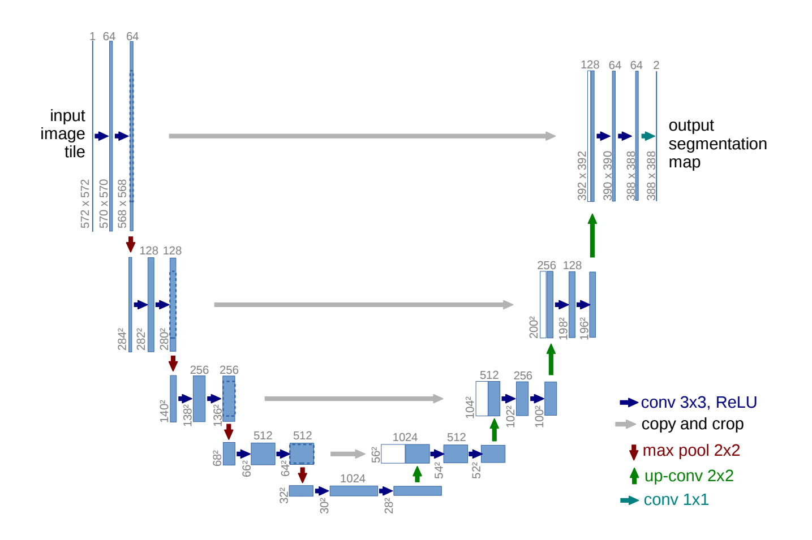

# UNet Implementation

PyTorch implementation of UNet for image segmentation.

This is my from-scratch implementation of the UNet architecture. I built each component to understand how the encoder-decoder structure works, implementing the double convolutions, max pooling, upsampling, and skip connections. The most interesting part was figuring out how to handle the spatial dimension mismatches between encoder and decoder paths through the cropping function. I followed exactly the architecture introduced in the [original UNet paper](https://arxiv.org/abs/1505.04597).



## Usage

```python
from model import UNet

# initialize model
model = UNet(num_classes=2)

# forward pass
x = torch.randn(1, 1, 572, 572)
output = model(x)     # output.shape is [1, 2, 388, 388]
```

## Notes

- No padding in convolutions
- Uses cropping for skip connections
- Input: grayscale images
- Based on original UNet paper (Ronneberger et al., 2015) https://arxiv.org/abs/1505.04597